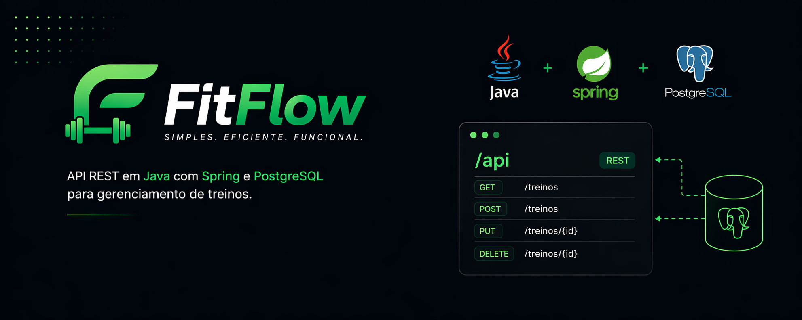

<p align="center">
  
</p>

<p align="center">
  
  
  
  
  
</p>

---

## 📖 Sobre o Projeto

**FitFlow** é uma API REST desenvolvida em Java com Spring Boot para gerenciamento de treinos em academias. O sistema permite cadastrar alunos, montar fichas de exercícios e organizar treinos por dias da semana.

O projeto foi desenvolvido como estudo prático de Spring Boot, aplicando boas práticas de arquitetura em camadas, DTOs, tratamento de exceções e configuração segura de credenciais.

---

## ✨ Funcionalidades

- ✅ Cadastro, listagem, atualização e exclusão de **Alunos**
- ✅ Cadastro, listagem, atualização e exclusão de **Exercícios** por grupo muscular
- ✅ Criação e gerenciamento de **Treinos** com dias da semana configuráveis
- ✅ Associação de exercícios a treinos com séries, repetições e ordem (**TreinoExercício**)
- ✅ Validação de dados com Bean Validation
- ✅ Tratamento global de exceções com respostas padronizadas
- ✅ Documentação interativa via Swagger UI

---

## 🛠️ Tecnologias

| Tecnologia | Descrição |
|---|---|
| Java 17 | Linguagem principal |
| Spring Boot 3.x | Framework backend |
| Spring Data JPA | Persistência e mapeamento ORM |
| Hibernate | Implementação JPA |
| MySQL 8.0 | Banco de dados relacional |
| Docker + Docker Compose | Containerização do banco de dados |
| Lombok | Redução de boilerplate |
| Bean Validation | Validação de DTOs |
| Springdoc OpenAPI | Documentação Swagger UI |
| Maven | Gerenciamento de dependências |

---

## 🗂️ Estrutura do Projeto

```
src/main/java/br/dev/guisleri/treinoapispring/
├── controller/       # Endpoints REST e GlobalExceptionHandler
├── service/          # Regras de negócio e interfaces de serviço
├── repo/             # Interfaces de repositório (Spring Data JPA)
├── model/            # Entidades JPA e Enums
├── dto/              # DTOs de request e response
└── exception/        # Exceções customizadas
```

---

## 🗃️ Modelo de Dados

```
Aluno (tb_alunos)
  └── Treino (tb_treinos)          [N Treinos para 1 Aluno]
        └── TreinoExercicio        [N Exercícios por Treino]
              └── Exercicio (tb_exercicios)

tb_treino_dias                     [dias da semana do treino]
```

### Enums disponíveis

**GrupoMuscular:** `PEITO` `COSTAS` `PERNAS` `OMBROS` `BICEPS` `TRICEPS` `ABDOMEN`

**DiasSemana:** `SEGUNDA` `TERCA` `QUARTA` `QUINTA` `SEXTA` `SABADO` `DOMINGO`

---

## 🚀 Como Executar

### Pré-requisitos

- Java 17+
- Maven
- Docker Desktop com WSL 2 (Windows) ou Docker Engine (Linux/Mac)

### 1. Clone o repositório

```bash
git clone https://github.com/seu-usuario/treino-api-spring.git
cd treino-api-spring
```

### 2. Suba o banco de dados com Docker

```bash
docker compose up -d
```

### 3. Configure as credenciais locais

Crie o arquivo `src/main/resources/application-local.properties` (já ignorado pelo Git):

```properties
spring.datasource.url=jdbc:mysql://localhost:3306/fitflow
spring.datasource.username=seu_usuario
spring.datasource.password=sua_senha
```

### 4. Execute a aplicação com o perfil local

No IntelliJ IDEA, adicione nas configurações de execução:

```
Active profiles: local
```

Ou via terminal:

```bash
mvn spring-boot:run -Dspring-boot.run.profiles=local
```

### 5. Acesse a documentação

```
http://localhost:8080/swagger-ui.html
```

---

## 📋 Endpoints

### Alunos — `/alunos`

| Método | Endpoint | Descrição |
|---|---|---|
| GET | `/alunos` | Lista todos os alunos |
| GET | `/alunos/{id}` | Busca aluno por ID |
| POST | `/alunos` | Cria novo aluno |
| PUT | `/alunos/{id}` | Atualiza aluno |
| DELETE | `/alunos/{id}` | Remove aluno por ID |
| DELETE | `/alunos` | Remove todos os alunos |

### Exercícios — `/exercicios`

| Método | Endpoint | Descrição |
|---|---|---|
| GET | `/exercicios` | Lista todos os exercícios |
| GET | `/exercicios/{id}` | Busca exercício por ID |
| POST | `/exercicios` | Cria novo exercício |
| PUT | `/exercicios/{id}` | Atualiza exercício |
| DELETE | `/exercicios/{id}` | Remove exercício por ID |

### Treinos — `/treinos`

| Método | Endpoint | Descrição |
|---|---|---|
| GET | `/treinos` | Lista todos os treinos |
| GET | `/treinos/{id}` | Busca treino por ID |
| POST | `/treinos` | Cria novo treino |
| PUT | `/treinos/{id}` | Atualiza treino |
| DELETE | `/treinos/{id}` | Remove treino por ID |

### Treino Exercícios — `/treino-exercicios`

| Método | Endpoint | Descrição |
|---|---|---|
| GET | `/treino-exercicios` | Lista todas as associações |
| GET | `/treino-exercicios/{id}` | Busca por ID |
| POST | `/treino-exercicios` | Associa exercício a treino |
| PUT | `/treino-exercicios/{id}` | Atualiza associação |
| DELETE | `/treino-exercicios/{id}` | Remove associação |

---

## 📦 Exemplos de Request

### Criar Aluno
```json
POST /alunos
{
  "nome": "Carlos Silva",
  "dataNascimento": "1995-03-15"
}
```

### Criar Exercício
```json
POST /exercicios
{
  "nome": "Supino Reto",
  "grupoMuscular": "PEITO"
}
```

### Criar Treino
```json
POST /treinos
{
  "nome": "Treino A - Peito e Tríceps",
  "alunoId": 1,
  "diasSemana": ["SEGUNDA", "QUINTA"]
}
```

### Adicionar Exercício ao Treino
```json
POST /treino-exercicios
{
  "treinoId": 1,
  "exercicioId": 1,
  "series": 4,
  "repeticoes": 12,
  "ordem": 1
}
```

---

## 🔒 Boas Práticas Aplicadas

- **Configuração segura:** credenciais nunca versionadas — uso de `${PLACEHOLDER}` no `application.properties` e arquivo `application-local.properties` ignorado pelo Git
- **Perfis Spring Boot:** separação entre configuração de desenvolvimento e produção via profiles
- **Camadas bem definidas:** controller → service → repository, cada uma com responsabilidade única
- **DTOs de request/response:** a entidade JPA nunca é exposta diretamente na API
- **Exceções customizadas:** cada entidade tem sua própria exceção tipada com tratamento global via `@RestControllerAdvice`
- **Conventional Commits:** histórico de commits padronizado e legível

---

## 👨‍💻 Autor

Desenvolvido por **Marcos Guisleri**

[](https://github.com/seu-usuario)
[](https://linkedin.com/in/seu-perfil)
